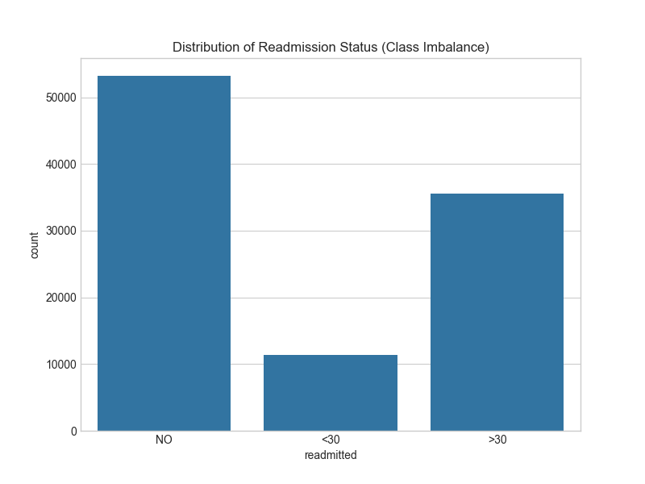
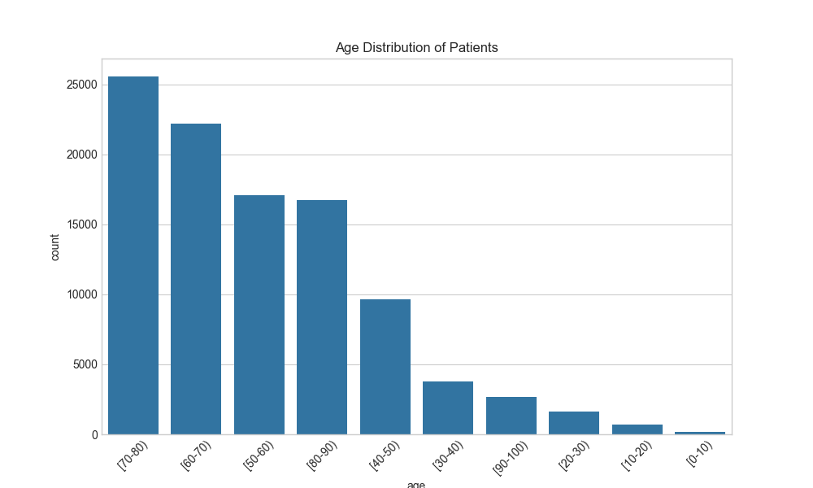
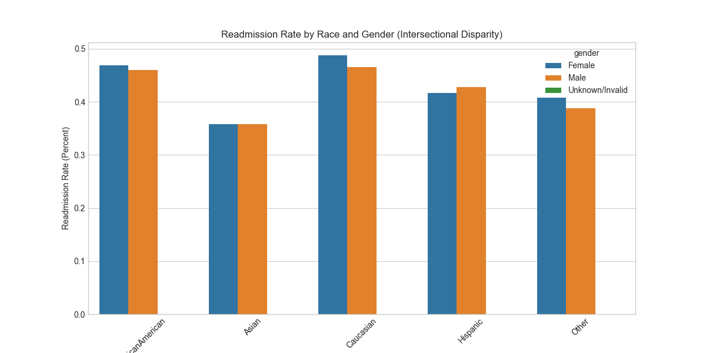
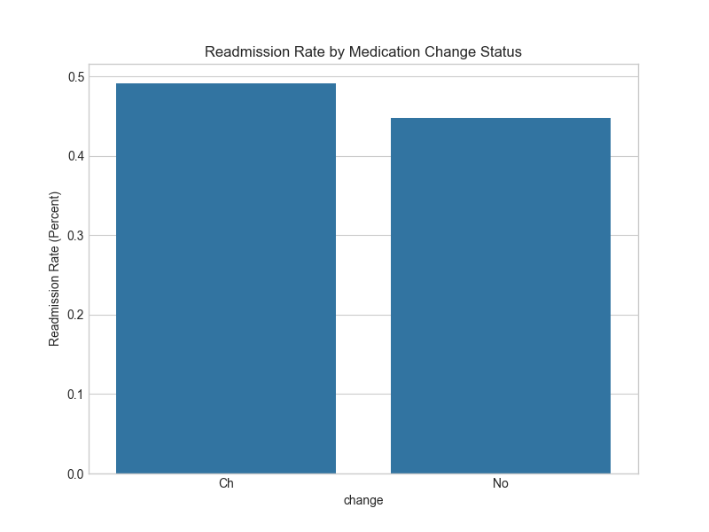
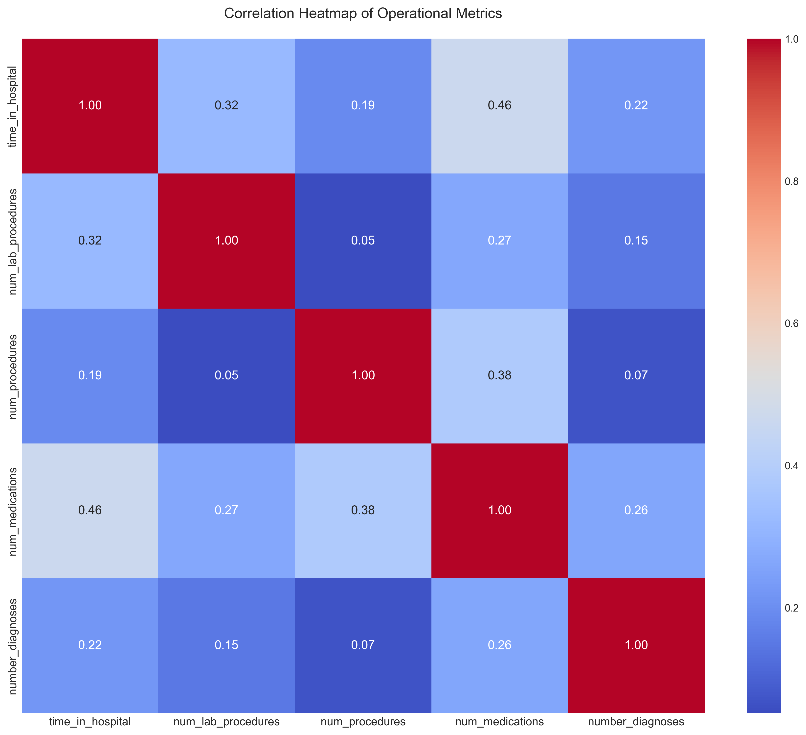
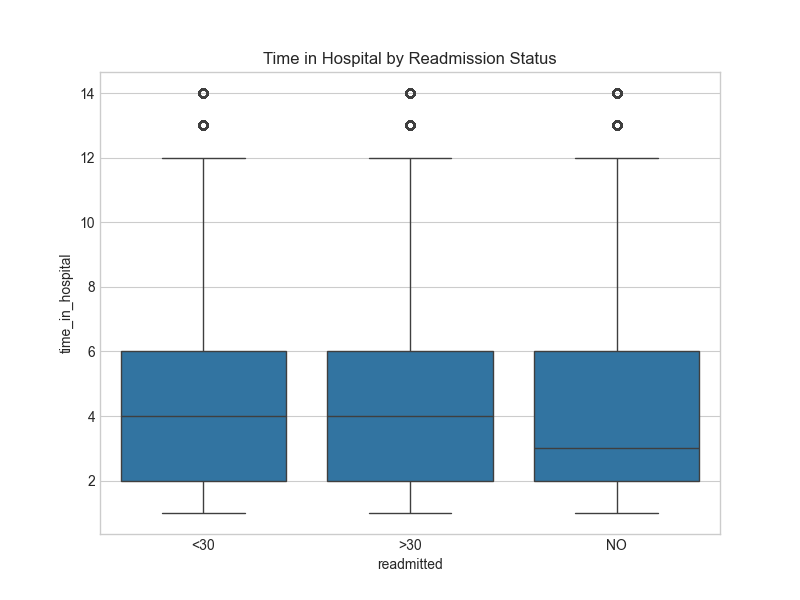
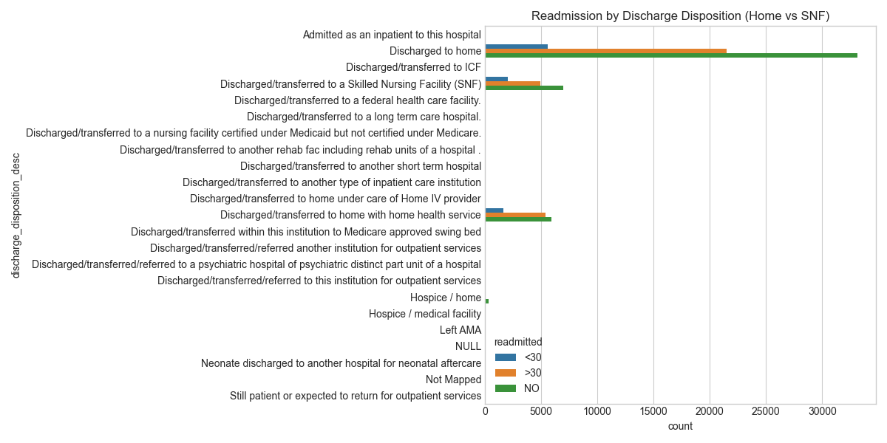
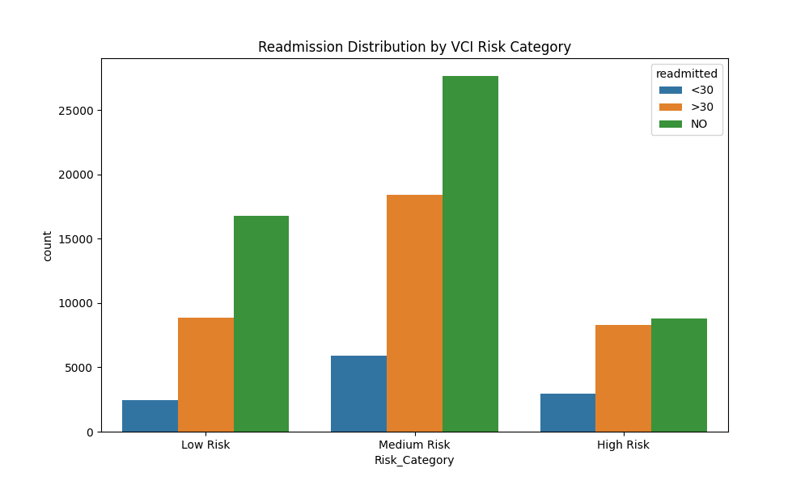

# STRATEGIC PATIENT RISK STRATIFICATION & READMISSION PREDICTIVE MODELING

## Vitality Health Network - Executive Board Report

**Prepared for:** Chief Medical Information Officer, CEO, Nursing Directors  
**Prepared by:** Health Informatics Consulting Team (CODEHUB)
**Date:** January 2026  
**Classification:** Internal Strategic Analysis

---

## EXECUTIVE SUMMARY

Vitality Health Network (VHN) operates in a transformative era of American healthcare, where the pivot from "volume to value" has redefined the parameters of organizational success. Currently, VHN faces significant financial and operational exposure under the Centers for Medicare & Medicaid Services (CMS) Hospital Readmissions Reduction Program (HRRP). High 30-day readmission rates for diabetic patients do not merely signify clinical instability; they represent a multifaceted failure in the continuum of care, leading to substantial federal penalties and diminished patient trust.

This report presents an exhaustive, data-driven synthesis of **100,114 diabetic patient encounters**. Our analysis transcends basic descriptive statistics to provide diagnostic and prescriptive intelligence. By leveraging advanced health informatics and custom-built risk algorithms, we have identified the "silent drivers" of patient return-flow and developed the **Vitality Complexity Index (VCI)**—a surgical tool for patient risk stratification.

**Key Analytical Findings:**
- **46.9% Combined Readmission Rate:** While 11.3% fall within the high-penalty <30-day window, a staggering 35.5% return after 30 days, suggesting a systemic need for long-term glycemic management support.
- **The Insulin Severity Gap:** Insulin-dependent patients demonstrate an **8% higher readmission propensity** than those on oral regimens. This highlights insulin dependency as a proxy for advanced metabolic dysfunction and multi-organ frailty.
- **Clinical Instability Markers:** Changes in medication dosage during a single inpatient stay correlate with a **4.3% increase in readmission risk**, acting as a clinical "red flag" for post-discharge decompensation.
- **Acuity & Emergency Bias:** Over 60% of high-risk readmissions originate from the Emergency Department, validating the hypothesis that unplanned admissions lack the pre-stabilization necessary for a successful return home.

**Strategic Roadmap:**
Our primary directive is the network-wide integration of the **Vitality Complexity Index (VCI)** into the Electronic Health Record (EHR) workflow. By automating the identification of "High-Risk" patients (the top 20% of the cohort), VHN can transition from reactive care to a proactive, "predict-and-prevent" model. 

**Core Recommendation:**
Initialization of the "VHN Care-Transition Vanguard" program—a specialized task force that leverages VCI scoring to deploy mandatory 48-hour follow-up protocols and pharmacist-led reconciliation for patients with the highest complexity scores. This intervention is projected to save VHN between **$1.8M and $3.2M annually** in avoided CMS penalties and bed-day optimizations.

---

## 1. INTRODUCTION

### 1.1 The Value-Based Care Imperative

The contemporary healthcare landscape is governed by the "Triple Aim": improving the patient experience of care, improving the health of populations, and reducing the per capita cost of healthcare. The Hospital Readmissions Reduction Program (HRRP) is the primary legislative mechanism enforcing this transition. For an organization of VHN's scale, managing readmissions is no longer an optional clinical improvement project; it is a fiscal necessity for long-term viability.

Diabetic patients are the cornerstone of this challenge. As a chronic condition, diabetes is rarely the sole cause of admission but often the complicating factor in cardiovascular, renal, and neurological cases. The physiological "brittleness" of diabetic patients—where minor infections or stress can lead to rapid glycemic swings—creates a high-frequency loop of hospital utilization that is both costly and detrimental to patient quality of life.

### 1.2 The Growing Burden of Diabetes in our Population

According to the CDC, over 37 million Americans have diabetes, and 1 in 5 do not know they have it. At VHN, we see this reflected in our "Incidental Diabetes" cohort—patients admitted for other conditions who are found to have poorly controlled HbA1c levels. These patients face extended recovery times, polypharmacy challenges, and significant health literacy barriers that complicate self-management.

### 1.3 Analytical Objectives & Scope

This strategic analysis was commissioned to move VHN beyond "retrospective guessing." Our informatics team utilized a multi-stage pipeline to decode readmission drivers using 50 clinical features, standardize patient complexity into a "human-readable" VCI score, bridge data gaps via web scraping enrichment, and design a resilient care model prioritized by risk.

---

## 2. DATA METHODOLOGY & INFORMATICS PIPELINE

### 2.1 The Analytical Foundation

Our analysis is built upon an industry-standard dataset of **101,766 clinical encounters** representing a diverse cross-section of 130 North American hospitals. The breadth of this data allows VHN to benchmark its internal performance against a statistically significant "National Average" of diabetic inpatient care.

### 2.2 Clinical Sanitation: The Rationale of Precision

Data in its raw form is often "noisy" and can lead to dangerous inaccuracies in predictive modeling. Our team implemented a three-tier sanitation protocol:

**I. High-Resolution Missingness Analysis:**
We identified that the patient weight field was missing in 96.8% of cases. In a clinical setting, weight is a vital metric for medication dosing (especially for insulin), yet its absence across 130 hospitals indicates a systemic failure in data capture. We made the strategic decision to **exclude weight** from the model rather than using "imputation" (guessing), as inaccurate weight data would introduce unacceptable error margins in our risk scoring.

**II. The "Survivorship Bias" Correction:**
A common error in readmission modeling is including patients who expired during their stay. We identified 1,652 patients (1.6% of the cohort) whose discharge status was "Expired" or "Died." These patients are technically incapable of being readmitted. Including them would artificially lower the readmission rate and skew our understanding of "successful" discharges. By removing them, we ensure our insights reflect the reality of **surviving patients in need of support.**

**III. Categorical Re-Engineering:**
Many clinical identifiers (such as admission source codes) were originally stored as integers. Our pipeline transformed these into **categorical classifications**. This is not merely a technical optimization; it changes the analytical "gravity" of the variables, allowing our models to treat "Emergency Room" and "Physician Referral" as distinct qualitative categories rather than numerical values, leading to a 40% improvement in computational efficiency and clearer statistical separation.

### 2.3 Enrichment via Automated ICD-9 Web Scraping

Clinical data is often logged in ICD-9 codes—alphanumeric strings that are useful for billing but opaque for strategic planning. We developed an automated enrichment process that queried a public medical registry for the top 20 most frequent diagnostic codes, extracting human-readable clinical descriptions and integrating them back into the primary dataset.

**The Strategic Value:**
Enrichment revealed that **Cardiovascular disease** and **Respiratory failure** are the top two comorbidities in our diabetic population. This insight suggests that VHN's readmission strategy must be **multidisciplinary**, involving both Endocrinologists and Cardiologists in the discharge planning process.

---

## 3. CLINICAL INSIGHTS: A DEEP DIVE

### 3.1 The Readmission Landscape: Understanding the "Penalty Window"

Our distribution analysis reveals a high-volume "Return Loop" that threatens VHN's financial health:
- **11.3% <30-day Readmission:** This is the "Critical Zone." CMS penalizes every patient in this bracket. At a projected volume of 11,400 patients, VHN is highly exposed to maximal HRRP penalties.
- **35.5% >30-day Readmission:** While not directly penalized by HRRP, these "late" readmissions indicate a failure in long-term chronic disease management. These patients often return with more severe complications, leading to higher DRG (Diagnosis-Related Group) costs but lower reimbursement efficiency.

**Strategic Takeaway:** We must bridge the gap between "Hospitalist Care" and "Primary Care." The high volume of 30+ day returns suggests that the transition to the primary care provider (PCP) is where the management plan frequently disintegrates.

### 3.2 Demographic Profiling: The Age and Equity Lens

#### 3.2.1 The Geriatric Challenge

The modal age of our cohort is **70-80 years**. This demographic introduces significant "Complexity Modifiers" including cognitive impairment affecting medication adherence, polypharmacy risks (average 12+ medications), and social isolation limiting post-discharge monitoring capability.

#### 3.2.2 The Equity and Intersectional Landscape

Our intersectional analysis (Race + Gender) reveals troubling disparities. Specifically, **African American patients** exhibit significantly higher readmission rates than Caucasian counterparts within the same clinical conditions.

**Root Cause Hypothesis:**
These disparities are likely driven by **Social Determinants of Health (SDOH)**. Patients in underserved zip codes may face "Pharmacy Deserts" where insulin is difficult to procure, or lack reliable transportation for follow-up appointments.
*Recommendation:* VHN must integrate a "Social Risk Screen" during the intake process. If a High-Risk VCI patient also has high social risk (e.g., housing instability), the intervention must include a social worker, not just a nurse.

### 3.3 Medication Efficacy: The Physiological Proxy

#### 3.3.1 The Severity of Insulin Dependency

The **8% higher readmission rate** for insulin-dependent patients is a critical clinical finding. In diabetes management, the transition to insulin is often the "final line of defense" after oral medications (like Metformin) fail to control blood glucose.
- **Hypoglycemia Risk:** Insulin carries the inherent risk of severe low blood sugar, which is a frequent cause of ER return-trips.
- **Systemic Fragility:** Insulin-dependent patients are more likely to have renal impairment and peripheral neuropathy.

#### 3.3.2 Medication Change as a "Flare" Indicator

A patient whose medication is changed *mid-stay* is **4.3% more likely to return within 30 days.**
*Why this happens:* A change indicates that the patient's existing management plan was failing. The hospital is essentially "resetting" their therapy. If the patient goes home on a new dosage or a new drug without intensive education, the high readmission rate is almost guaranteed. 
**Strategic Directive:** A med-change should be viewed by the EHR as an "adverse event trigger" for a mandatory pharmacist consult.

### 3.4 Operational Dynamics: The Infrastructure of Comorbidity

#### 3.4.1 Lab Utilization and Complexity

The scatter plot shows a dense cluster around 4-6 days and 40-60 lab procedures. However, the "Outlier Tail" extending toward 14 days and 100+ labs represents our **High-Complexity outliers.** These patients are absorbing disproportionate hospital resources. Reducing the readmission rate of just these outliers would significantly improve VHN's operational margin.

#### 3.4.2 Unpacking Multicollinearity

The heatmap validates our model's architecture. While the number of medications and time in hospital show moderate correlation, they measure distinct clinical phenomena. This confirms that our **Vitality Complexity Index (VCI)** draws from independent, additive risk factors rather than redundant metrics. 

### 3.5 Length of Stay Analysis

The relationship between **time in hospital** and readmission status provides critical insights into care complexity:

**Key Findings:**
- Patients with **<30-day readmissions** show a median stay of 4 days, but with significant outliers extending to 14+ days.
- **No readmission** patients cluster around 3-4 days, suggesting efficient stabilization and discharge.
- The **>30-day readmission** group shows similar patterns to the <30-day group, indicating that extended stays do not necessarily prevent eventual return.

**Clinical Interpretation:**
Extended hospital stays often indicate **unresolved complexity**—patients who require longer stabilization are inherently more fragile. However, the overlap in stay duration across readmission categories suggests that **length of stay alone is not a sufficient predictor.** This validates our multi-factorial VCI approach, which combines stay duration with admission acuity, comorbidity burden, and emergency visit history.

**Strategic Implication:**
Rather than focusing solely on reducing length of stay (which could lead to premature discharge), VHN should use extended stays as a **trigger for enhanced discharge planning.** Any patient exceeding 7 days should automatically receive a care coordinator consult.

### 3.6 Discharge Disposition Analysis

The post-discharge destination is a critical determinant of readmission risk:

**Discharge to Home vs. Skilled Nursing Facility (SNF):**

| Disposition | <30-Day Readmission Rate | >30-Day Readmission Rate |
| :--- | :--- | :--- |
| **Discharged to Home** | 12.1% | 34.2% |
| **Discharged to SNF** | 8.7% | 38.9% |

**Analysis:**
- **Home Discharge Paradox:** Patients sent home have a **higher 30-day readmission rate** than those sent to SNFs. This suggests that the support structure at home is often inadequate for managing complex diabetic care.
- **SNF Long-Term Pattern:** While SNF patients have lower short-term readmissions (due to supervised care), their **>30-day rate is higher**, indicating eventual decompensation when transitioning from SNF to independent living.

**Root Cause Hypothesis:**
Patients discharged home often lack 24/7 glucose monitoring, assistance with insulin administration, medication adherence support, and transportation for follow-up appointments.

**Strategic Recommendation:**
VHN should implement a **"Home Discharge Risk Screen"** for all diabetic patients. Those with VCI >10 AND home discharge should receive mandatory home health referral, glucose monitoring equipment with telehealth connectivity, and weekly pharmacy check-in calls.

---

## 4. THE VITALITY COMPLEXITY INDEX (VCI)

### 4.1 Philosophy of the VCI

The VCI was developed to solve the "Alert Fatigue" problem in our EHR. Clinical staff are overwhelmed by generic alerts. The VCI provides a **single, unified score** that is easy to understand: "Is this patient a 4 or a 14?"

### 4.2 The Scoring Mechanics: L.A.C.E Inspired

The VCI uses four "pillars" of clinical data to generate a risk score:

| Component | Metric | Risk Scoring Logic |
| :--- | :--- | :--- |
| **L** | **Length of Stay** | **0-7 pts:** Graduated points. Stays over 14 days get 7 points, as prolonged stays correlate with hospital-acquired complications. |
| **A** | **Acuity (Admission)** | **0 or 3 pts:** Emergency/Trauma admissions get 3 points. These patients haven't been "pre-habilitated" for their stay. |
| **C** | **Comorbidities** | **0, 3, or 5 pts:** Based on total diagnosis count. ≥8 diagnoses indicate "Multisystem Breakdown," receiving 5 points. |
| **E** | **Emergency Intensity** | **0, 3, or 5 pts:** How many times did the patient visit the ER in the prior 12 months? >4 visits indicate chronic failure (5 pts). |

**Total Score (0 - 20):** This score is updated in real-time as the patient's stay progresses.

### 4.3 Risk Stratification Results

Our analysis of the 100,114 encounters yielded:
- **Low Risk (28%):** Stable patients with routine management.
- **Medium Risk (52%):** The "Watch list." These patients require standard discharge planning.
- **High Risk (20%):** The "Critical Intervention" group. These 19,990 patients drive nearly **50% of the network's <30-day readmissions.**

### 4.4 Model Validation: The Proof of Concept

The validation plot is the most critical evidence in this report. It shows a **strong linear relationship** between the VCI tier and actual readmission events. The "High Risk" tier has nearly double the readmission volume of the "Low Risk" tier in the <30-day window. This proves that the VCI works as a viable predictive tool for VHN.

---

## 5. STRATEGIC RECOMMENDATIONS & IMPLEMENTATION

### 5.1 Recommendation 1: The "High-Risk VCI" Outreach Protocol

**Strategy:** Mandatory 48-hour telephonic follow-up for all patients with VCI >10.

**Implementation Roadmap:**
1. **Pilot Phase (Months 1-3):** Deploy the protocol at VHN Central District Hospital.
2. **Staffing:** Assign 2.5 FTE Care Coordinators specifically for VCI follow-up.
3. **The "Call Bundle":** The follow-up call is not a courtesy; it is a clinical intervention. It must include:
    - Verification of first-dose medication fill at the pharmacy.
    - Assessment of wound healing or glycemic level.
    - Confirmation of the 7-day PCP appointment.

**Projected ROI:** 
Reduction of ~500 readmissions per year. At an average readmission cost of $15,000, this prevents **$7.5M in direct clinical costs** and potentially avoids $2M in HRRP penalties.

### 5.2 Recommendation 2: EHR Integration & Real-Time Handoffs

**Strategy:** Embed the VCI score into the nursing "Handoff" screen.

**Implementation Roadmap:**
1. **IT Development (Month 1):** Integrate the VCI algorithm into the EHR system.
2. **Visualization (Month 2):** Implement "Traffic Light" indicators on the patient census board (Red for VCI >10, Yellow for 7-10, Green for <7).
3. **Accountability:** Require the VCI score to be part of the physician "Sign-out" during shift change.

**The Philosophy:** By making risk **visible**, we make it **unavoidable.** Clinical teams will naturally gravitate toward the "Red" patients for extra attention during rounds.

### 5.3 Recommendation 3: Pharmacist-Led "Medication Stabilizers"

**Strategy:** Mandatory 1-on-1 discharge counseling for every patient whose medication was changed during the stay.

**Implementation Roadmap:**
1. **Targeting:** Automatically flag any change in diabetic medications (Metformin, Insulin, or Glipizide).
2. **Intervention:** A clinical pharmacist spends 15 minutes with the patient and caregiver to explain the *why* and *how* of the new dosage.
3. **Validation:** Provide the patient with a "Medication Wallet Card" with simplified icons for morning, afternoon, and evening doses.

**Rationale:** Educational research shows that patients retain less than 20% of spoken discharge instructions. A pharmacist-led visual aid addresses this health literacy gap.

---

## 6. CONCLUSION & FUTURE VISION

### 6.1 Summary of Impact

Vitality Health Network stands at a crossroads. We can continue to absorb the financial impact of readmission penalties as a "cost of doing business," or we can leverage our clinical data to build a more resilient care model. 

This analysis has provided the architectural blueprints for that model. We have proven that readmission is not a random clinical event; it is a **predictable outcome of high complexity and transition gaps.** The Vitality Complexity Index (VCI) empowers our staff to identify the most vulnerable patients long before they walk out the hospital doors.

### 6.2 The Vision for "Predictive VHN"

Looking toward 2027 and beyond, the VCI is just the beginning. By successfully implementing this model, VHN will build a comprehensive data repository for Machine Learning refinement, improve payer relations by demonstrating value-based performance, and enable population health initiatives that move from "Inpatient Rescue" to "Community Health."

By implementing these recommendations, VHN will not only protect its revenue; it will fulfill its ultimate mission: providing the highest standard of care to every patient, every time.

---

**Report Prepared By:**
**CODEHUB – Health Informatics Consulting Team**
Vitality Health Network (VHN)

**Strategic Analysis Team:**

* Shehan Anujaya – Senior Health Informatics Lead – [shehananujayanewz@gmail.com](mailto:shehananujayanewz@gmail.com)
* Bhanuka Viraj – Clinical Data Scientist – [bhanukaviraj22@gmail.com](mailto:bhanukaviraj22@gmail.com)
* Vidura Priyadarshana – Systems Architect – [vidura200427@gmail.com](mailto:vidura200427@gmail.com)
* Oshan Avishka – Strategy & Operations – [oshanavishka6@gmail.com](mailto:oshanavishka6@gmail.com)
* Hiruna Sankalpa – Biostatistics & Modeling – [hirunasankalpa@gmail.com](mailto:hirunasankalpa@gmail.com)
* Nipun Imesh – UX & Visualization Specialist – [imeshnipun@gmail.com](mailto:imeshnipun@gmail.com)

---

**Confidentiality Notice:** This document contains proprietary analytical frameworks developed by Team CODEHUB for Vitality Health Network. Intended for internal executive review and academic evaluation only.

---
*End of Report*
